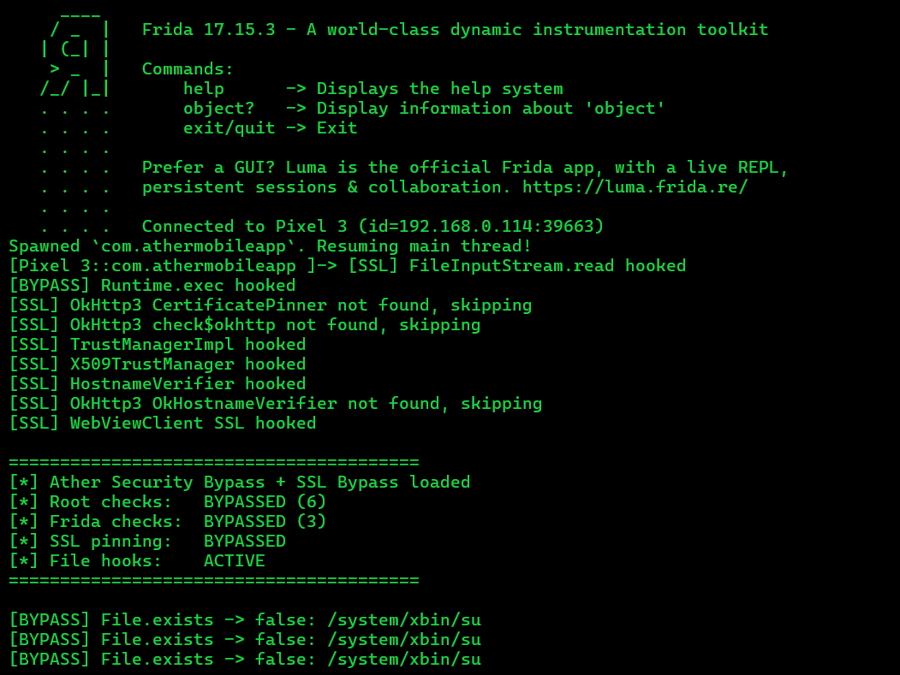

<div align="center">

<!-- Animated Banner SVG -->
<svg width="600" height="200" viewBox="0 0 600 200" xmlns="http://www.w3.org/2000/svg">
  <defs>
    <linearGradient id="grad" x1="0%" y1="0%" x2="100%" y2="0%">
      <stop offset="0%" style="stop-color:#00ff88;stop-opacity:1" >
        <animate attributeName="stop-color" values="#00ff88;#00aaff;#ff00aa;#00ff88" dur="4s" repeatCount="indefinite"/>
      </stop>
      <stop offset="50%" style="stop-color:#00aaff;stop-opacity:1" >
        <animate attributeName="stop-color" values="#00aaff;#ff00aa;#00ff88;#00aaff" dur="4s" repeatCount="indefinite"/>
      </stop>
      <stop offset="100%" style="stop-color:#ff00aa;stop-opacity:1" >
        <animate attributeName="stop-color" values="#ff00aa;#00ff88;#00aaff;#ff00aa" dur="4s" repeatCount="indefinite"/>
      </stop>
    </linearGradient>
    <filter id="glow">
      <feGaussianBlur stdDeviation="3" result="coloredBlur"/>
      <feMerge>
        <feMergeNode in="coloredBlur"/>
        <feMergeNode in="SourceGraphic"/>
      </feMerge>
    </filter>
  </defs>
  
  <!-- Background -->
  <rect width="600" height="200" fill="#0d1117" rx="10"/>
  
  <!-- Animated circuit lines -->
  <g stroke="#00ff8833" stroke-width="1" fill="none">
    <path d="M0,50 L100,50 L120,70 L200,70">
      <animate attributeName="stroke-dashoffset" from="500" to="0" dur="3s" repeatCount="indefinite"/>
    </path>
    <path d="M600,100 L500,100 L480,120 L400,120">
      <animate attributeName="stroke-dashoffset" from="500" to="0" dur="2.5s" repeatCount="indefinite"/>
    </path>
    <path d="M0,150 L80,150 L100,130 L180,130">
      <animate attributeName="stroke-dashoffset" from="500" to="0" dur="3.5s" repeatCount="indefinite"/>
    </path>
  </g>
  
  <!-- Lock icon (animated) -->
  <g transform="translate(80, 60)" filter="url(#glow)">
    <rect x="10" y="35" width="40" height="30" rx="3" fill="none" stroke="url(#grad)" stroke-width="2">
      <animate attributeName="opacity" values="1;0.5;1" dur="2s" repeatCount="indefinite"/>
    </rect>
    <path d="M20,35 V25 C20,15 40,15 40,25 V35" fill="none" stroke="url(#grad)" stroke-width="2"/>
    <circle cx="30" cy="50" r="4" fill="url(#grad)">
      <animate attributeName="r" values="4;6;4" dur="1.5s" repeatCount="indefinite"/>
    </circle>
  </g>
  
  <!-- Main Title -->
  <text x="300" y="85" text-anchor="middle" font-family="monospace" font-size="28" font-weight="bold" fill="url(#grad)" filter="url(#glow)">
    ATHER SSL BYPASS
    <animate attributeName="opacity" values="1;0.7;1" dur="3s" repeatCount="indefinite"/>
  </text>
  
  <!-- Subtitle -->
  <text x="300" y="115" text-anchor="middle" font-family="monospace" font-size="14" fill="#8b949e">
    Frida Security Bypass Toolkit
  </text>
  
  <!-- Animated dots -->
  <circle cx="50" cy="180" r="2" fill="#00ff88">
    <animate attributeName="opacity" values="0;1;0" dur="1.5s" repeatCount="indefinite"/>
  </circle>
  <circle cx="70" cy="180" r="2" fill="#00aaff">
    <animate attributeName="opacity" values="0;1;0" dur="1.5s" begin="0.3s" repeatCount="indefinite"/>
  </circle>
  <circle cx="90" cy="180" r="2" fill="#ff00aa">
    <animate attributeName="opacity" values="0;1;0" dur="1.5s" begin="0.6s" repeatCount="indefinite"/>
  </circle>
</svg>

<!-- Badges -->
<a href="https://frida.re">
  
</a>
<a href="https://github.com/SAM0-0/Ather-SSL-Pinning-Bypass/blob/main/LICENSE">
  
</a>
<a href="https://github.com/SAM0-0/Ather-SSL-Pinning-Bypass">
  
</a>

<br/>

**Complete security bypass for Ather Mobile App — root detection, Frida detection, and SSL pinning.**

**Tested on app version:** `13.3.0`

> **Requires rooted Android device with frida-server running.**

</div>

---

## ⚡ What's Inside

### 🔓 Root Detection Bypass

| Method | Result |
|--------|--------|
| `performSecurityCheck` | Clean |
| `checkRootBinaries` | `false` |
| `checkRootPackages` | `false` |
| `checkSuExistence` | `false` |
| `checkDangerousProps` | `false` |
| `isSystemPartitionReadWrite` | `false` |
| `checkSELinuxStatus` | `false` |
| `isEnvironmentSuspect` | `false` |

### 🕵️ Frida Detection Bypass

| Method | Result |
|--------|--------|
| `checkFridaProcesses` | `false` |
| `checkFridaPorts` | `false` |
| `checkFridaArtifacts` | `false` |
| `String.contains` hooks | Active |
| `/proc/net/tcp` filter | Active |
| `Runtime.exec` intercept | Active |

---

## 🛡️ SSL Pinning Bypass

| Category | Hooks |
|----------|-------|
| **OkHttp3** | `CertificatePinner`, `check$okhttp`, `OkHostnameVerifier` |
| **Android Platform** | `TrustManagerImpl`, `X509TrustManager`, `SSLContext.init` |
| **Custom Hooks** | `HostnameVerifier`, `WebViewClient`, `FileInputStream` |

---

## 🚀 Quick Start

### 1. Install Frida
```bash
pip install frida-tools frida
```

### 2. Push frida-server to device
```bash
adb push frida-server-17.x-android-$(adb shell getprop ro.product.cpu.abi) /data/local/tmp/
adb shell "chmod 755 /data/local/tmp/frida-server"
adb shell "/data/local/tmp/frida-server &"
```

### 3. Run the bypass
```bash
frida -U -f com.athermobileapp -l ather-bypass.js
```

**Or attach to running app:**
```bash
frida -U com.athermobileapp -l ather-bypass.js
```

---

## 📸 Screenshot

<div align="center">



</div>

---

## 📁 File Hooks Summary

| Hook | Target | Effect |
|------|--------|--------|
| `File.exists()` | su binaries, frida-server | Returns `false` |
| `File.canExecute()` | su binaries | Returns `false` |
| `System.getenv("PATH")` | PATH variable | Strips `/su` paths |
| `FileReader` | SELinux enforce | Spoofs to `1` (enforcing) |
| `BufferedReader` | /proc/mounts | Changes `rw` → `ro` |
| `FileInputStream` | /proc/net/tcp | Filters Frida ports |
| `Runtime.exec` | ps commands | Intercepts |
| `String.contains` | frida/xposed/substrate | Returns `false` |

---

## ⚠️ Disclaimer

> **This tool is for educational and authorized security testing purposes only.**
> Unauthorized access to computer systems is illegal.
> Always obtain proper authorization before testing.

---

<div align="center">

**Made with 💚 by [SAM0-0](https://github.com/SAM0-0)**

<sub>Star this repo if it helped you!</sub>

</div>
	
